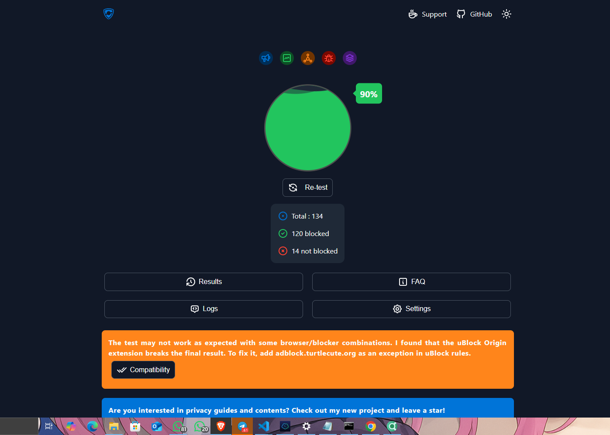
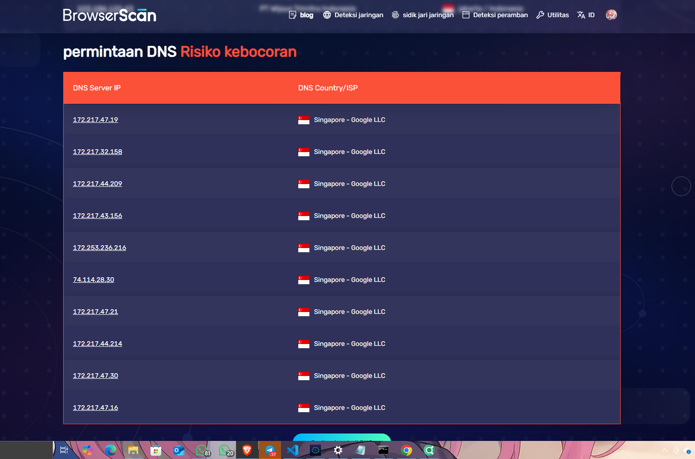
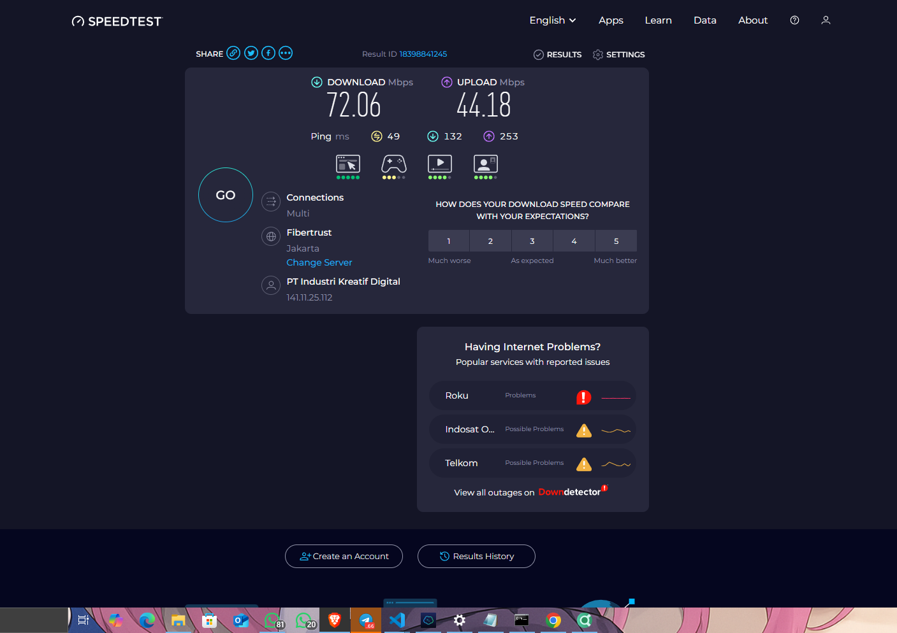

Siap—ini README.md-nya sudah **aku update** dengan bagian **Hasil Pengujian (Screenshots)** yang menampilkan tiga SS (AdBlock, DNS Leak, Speedtest). Kalau nama file gambarmu beda, tinggal ganti path-nya aja ya.

```md
# OpenClash Config – Region-Scoped Load-Balance (ID & SG)

Dokumentasi lengkap untuk konfigurasi **OpenClash (Clash.Meta)** dengan **Load-Balance per region** (Indonesia & Singapore) + *master switch* yang fleksibel. Cocok buat router OpenWrt dengan OpenClash.

---

## Daftar Isi

* [Fitur Utama](#fitur-utama)
* [Struktur File](#struktur-file)
* [Persyaratan](#persyaratan)
* [Instalasi Cepat](#instalasi-cepat)
* [Konfigurasi Lengkap](#konfigurasi-lengkap)
* [Penjelasan Bagian Config](#penjelasan-bagian-config)
* [Cara Pakai di UI OpenClash](#cara-pakai-di-ui-openclash)
* [Contoh *Personal Rules*](#contoh-personal-rules)
* [Tips & Best Practice](#tips--best-practice)
* [Troubleshooting](#troubleshooting)
* [FAQ](#faq)
* [Hasil Pengujian (Screenshots)](#hasil-pengujian-screenshots)
* [Catatan Keamanan](#catatan-keamanan)
* [Lisensi](#lisensi)

---

## Fitur Utama

* **Load-Balance Per Region**
  * `LB-ID` untuk pool node Indonesia (provider `pp_id`)
  * `LB-SG` untuk pool node Singapore (provider `pp_sg`)
  * `BALANCE-ALL` untuk gabungan ID+SG
* **Selector Manual Per Region**
  * `INDONESIA` & `SINGAPORE` (pilih node tertentu)
* **Master Switch GLOBAL**
  * Pilih cepat: `LB-ID`, `LB-SG`, `BALANCE-ALL`, atau manual per-region
* **Blokir Iklan via Rule Provider**
  * Grup `ADS` default `REJECT`
* **Kontrol QUIC (UDP:443)**
  * Grup `QUIC` bisa `REJECT` (matikan QUIC) atau `GLOBAL` (izinkan)
* **DNS Engine Anti-Hijack**
  * DoQ AdGuard unfiltered, fake-IP mode, DNS hijack 53
* **TUN & Auto-Routing**
  * Routing otomatis tanpa iptables manual
* **Sniffer TLS/HTTP**
  * Pemetaan rules lebih akurat walau tanpa DNS

---

## Struktur File

Letakkan file di **/etc/openclash/** (OpenWrt).

```

/etc/openclash/
├─ config/
│  └─ openclash-region-lb.yaml      # file config utama (namanya bebas)
├─ proxy_provider/
│  ├─ fadzWRT-id.yaml               # daftar node Indonesia
│  └─ fadzWRT-sg.yaml               # daftar node Singapore
├─ rule_provider/
│  └─ category-ads-all.yaml         # terisi otomatis oleh OpenClash (http provider)
└─ rules/
└─ personal.yaml                 # aturan pribadi (opsional)

````

> **Catatan**: Pastikan kedua provider (`fadzWRT-id.yaml`, `fadzWRT-sg.yaml`) **ada & berisi**.

---

## Persyaratan

* OpenWrt + **OpenClash** (core **Clash.Meta** terbaru disarankan)
* Ruang penyimpanan untuk rule/provider
* Akses LuCI (UI web) atau SSH
* File provider **ID** & **SG**

---

## Instalasi Cepat

1. **Salin file config** ke `/etc/openclash/config/openclash-region-lb.yaml`.
2. **Salin provider**:
   * `fadzWRT-id.yaml` → `/etc/openclash/proxy_provider/`
   * `fadzWRT-sg.yaml` → `/etc/openclash/proxy_provider/`
3. (Opsional) **Buat rules personal** di `/etc/openclash/rules/personal.yaml` (contoh di bawah).
4. Buka **LuCI → Services → OpenClash → Config Manage**:
   * Upload/Select `openclash-region-lb.yaml` sebagai config aktif.
5. Di tab **Dashboard/Proxies**:
   * Pastikan `pp_id` & `pp_sg` terbaca (ada daftar node & RTT).
   * Pilih `GLOBAL = BALANCE-ALL` (rekomendasi awal).
6. **Start/Restart** OpenClash.

---

## Konfigurasi Lengkap

> Salin isi ini ke `/etc/openclash/config/openclash-region-lb.yaml`.

```yaml
# ===============================
#  OpenClash (Clash.Meta) config
#  Region-scoped Load-Balance
# ===============================

# --- Ports ---
port: 9794
socks-port: 9795
mixed-port: 9796
redir-port: 9797
tproxy-port: 9898

allow-lan: true
bind-address: '*'
find-process-mode: always
mode: rule
log-level: error

ipv6: true
keep-alive-interval: 30
tcp-concurrent: true
inbound-tfo: true
unified-delay: true

global-ua: "Mozilla/5.0 (Linux; Android 14; Pixel 7 Build/AP2A.240705.004; wv) AppleWebKit/537.36 (KHTML, like Gecko) Version/4.0 Chrome/126.0.6478.8 Mobile Safari/537.36"
global-client-fingerprint: chrome

external-controller: 0.0.0.0:9090
external-ui: /usr/share/openclash/ui

profile:
  store-fake-ip: true
  store-selected: true

# ----- Anchors (preset LB/HC) -----
anchor:
  gen204: &gen204 'https://www.gstatic.com/generate_204'
  t: &t {url: *gen204, interval: 3600, tolerance: 50, lazy: true, timeout: 5, success-code: 204, expected-status: 204}
  lb: &lb {type: load-balance, strategy: consistent-hashing, url-test: *t, <<: *t}
  fb: &fb {type: fallback, <<: *t}
  ut: &ut {type: url-test, <<: *t}
  pp: &pp {health-check: {enable: true, lazy: false, <<: *t}}

# ----- Hosts -----
hosts:
  rule-set:personal: 127.0.0.1

# ----- DNS -----
dns:
  enable: true
  cache-algorithm: arc
  ipv6: true
  prefer-h3: true
  use-hosts: true
  use-system-hosts: false
  listen: 0.0.0.0:1053
  respect-rules: false

  nameserver:
    - 'quic://unfiltered.adguard-dns.com#GLOBAL'

  default-nameserver:
    - 'tcp://94.140.14.140#GLOBAL'

  proxy-server-nameserver:
    - 'tcp://112.215.198.254:53#DIRECT'
    - 'tcp://112.215.198.248:53#DIRECT'

  nameserver-policy:
    rule-set:personal: rcode://success

  enhanced-mode: fake-ip
  fake-ip-range: 198.18.0.1/16
  fake-ip-filter:
    - dns.msftnsci.com
    - www.msftnsci.com
    - www.msftconnecttest.com
    - time.android.com
    - lens.l.google.com
    - stun.l.google.com
    - global.stun.twilio.com
    - stun.nextcloud.com
    - stun.cloudflare.com
    - stun.voip.blackberry.com

  fallback: []
  fallback-filter: {}

# ----- SNIFFER -----
sniffer:
  enable: true
  force-dns-mapping: true
  parse-pure-ip: true
  override-destination: false
  sniff:
    TLS: {ports: [443, 8443]}
    HTTP: {ports: [80, 8080-8880], override-destination: true}
  sniffing: [tls, http]

# ----- TUN (OpenWrt) -----
tun:
  enable: true
  stack: system     # system/gvisor
  mtu: 1500
  dns-hijack:
    - any:53
    - tcp://any:53
  auto-route: true
  auto-detect-interface: true

# ===============================
# PROVIDERS (file terpisah per region)
# ===============================
proxy-providers:
  pp_id:
    <<: *pp
    type: file
    path: ./proxy_provider/fadzWRT-id.yaml
  pp_sg:
    <<: *pp
    type: file
    path: ./proxy_provider/fadzWRT-sg.yaml

proxies: []

# ===============================
# GROUPS
# ===============================
proxy-groups:
  # Util
  - {name: ADS, type: select, proxies: [REJECT, GLOBAL], default: REJECT}
  - {name: QUIC, type: select, proxies: [REJECT, GLOBAL], default: REJECT}

  # Selector manual per-region (pilih node tertentu)
  - name: INDONESIA
    type: select
    use: [pp_id]

  - name: SINGAPORE
    type: select
    use: [pp_sg]

  # Load-Balance per-region
  - name: LB-ID
    <<: *lb
    use: [pp_id]
    exclude-filter: "⚠️"

  - name: LB-SG
    <<: *lb
    use: [pp_sg]
    exclude-filter: "⚠️"

  # Load-Balance gabungan
  - name: BALANCE-ALL
    <<: *lb
    use: [pp_id, pp_sg]
    exclude-filter: "⚠️"

  # (Opsional) Grup OTHER untuk pool non-ID/SG jika nanti ditambah
  - name: OTHER
    type: select
    include-all-providers: true
    exclude-filter: "(🇮🇩|\\bID\\b|Indonesia|JKT|Jakarta|🇸🇬|\\bSG\\b|Singapore|SGP|SG-|SG\\d)"

  # Master switch
  - name: GLOBAL
    type: select
    proxies:
      - LB-ID
      - LB-SG
      - BALANCE-ALL
      - INDONESIA
      - SINGAPORE
      - OTHER
    default: BALANCE-ALL

# ===============================
# RULE PROVIDERS
# ===============================
rule-providers:
  category-ads-all:
    type: http
    behavior: domain
    url: 'https://raw.githubusercontent.com/tonggaret/dlc-geosite/subscribe/category-ads-all/category-ads-all'
    path: ./rule_provider/category-ads-all.yaml
    interval: 86400
    format: text

  personal:
    type: file
    behavior: domain
    path: ./rules/personal.yaml

# ===============================
# RULES
# ===============================
rules:
  - RULE-SET,personal,REJECT
  - RULE-SET,category-ads-all,ADS
  - AND,((NETWORK,udp),(DST-PORT,443)),QUIC
  - MATCH,GLOBAL
````

---

## Penjelasan Bagian Config

### Ports & Basic

* **mixed/redir/tproxy** dipakai OpenClash untuk intercept trafik. Ubah hanya jika bentrok port.
* `mode: rule` → alur **Rules → Group → Proxy**.

### Anchors

Preset biar singkat:

* `*lb` = `load-balance` + health-check.
* Bisa diganti ke `url-test` jika ingin selalu pilih node RTT terbaik.

### DNS

* **fake-ip** + **dns-hijack**: cegah hijack ISP & iklan.
* `nameserver` via **DoQ** (AdGuard unfiltered).
* `proxy-server-nameserver` via **DIRECT** agar lookup node cepat.

### Sniffer

* Baca SNI/Host dari TLS/HTTP untuk akurasi pemetaan rules.

### TUN

* `stack: system` (kernel OpenWrt) → stabil & ringan.
* `auto-route`, `auto-detect-interface` → minim setting manual.

### Providers & Groups

* `pp_id`/`pp_sg` adalah **file provider** terpisah.
* Grup utama:

  * `INDONESIA`, `SINGAPORE`: **pilih node manual**.
  * `LB-ID`, `LB-SG`: **load-balance** per region.
  * `BALANCE-ALL`: LB gabungan ID+SG.
  * `GLOBAL`: **master switch** (default `BALANCE-ALL`).
  * `ADS`: default **REJECT** (blokir iklan).
  * `QUIC`: default **REJECT** (matikan QUIC).

### Rules

Urutan eksekusi:

1. `personal` → **REJECT** (ubah sesuai kebutuhan).
2. `category-ads-all` → ke grup **ADS** (default blokir).
3. UDP:443 → grup **QUIC** (boleh kamu set `GLOBAL` kalau ingin QUIC aktif).
4. `MATCH → GLOBAL` (sisanya ikut master switch).

---

## Cara Pakai di UI OpenClash

1. Buka **Proxies**:

   * Pilih `GLOBAL`: `LB-ID` / `LB-SG` / `BALANCE-ALL` (rekomendasi awal `BALANCE-ALL`).
   * Kalau mau kunci satu node, pilih `INDONESIA` atau `SINGAPORE` lalu klik node spesifik.
2. Buka **Providers**:

   * Pastikan `pp_id` & `pp_sg` memuat node & RTT (bukan 0).
   * Klik **Update/Health-Check** jika perlu.
3. Untuk blokir iklan:

   * Pastikan `ADS = REJECT`.
4. Untuk QUIC:

   * `QUIC = REJECT` (matikan).
   * `QUIC = GLOBAL` (izinkan lewat proxy).

---

## Contoh *Personal Rules*

`/etc/openclash/rules/personal.yaml` (opsional):

```yaml
payload:
  # Contoh blokir domain tertentu
  - '+.iklan.example.com'
  - 'ads.example.net'

  # (Alternatif) kalau ingin BYPASS domain lokal:
  # Ubah rule utama di config jadi: RULE-SET,personal,DIRECT
  # lalu isi payload domain-domain yang mau DIRECT:
  # - '+.bank-lokal.co.id'
  # - '+.cdn-lokal.id'
```

Kalau kamu ganti aksi `personal` dari `REJECT` ke `DIRECT`, ubah baris rules di config:

```yaml
- RULE-SET,personal,DIRECT
```

---

## Tips & Best Practice

* **Stabilitas**: Pertahankan `load-balance (consistent-hashing)` untuk sesi stabil.
  Ingin RTT tercepat? Ganti `*lb` ke `type: url-test`.
* **Penamaan Node**: Tambahkan penanda region (`ID`, `SG`) agar mudah disortir/regex.
* **Performa UI**: `log-level: error` & interval health-check tidak terlalu rapat.
* **Backup**: Simpan cadangan config & provider sebelum update besar.

---

## Troubleshooting

**Grup “Compatible” muncul**
→ Selector kosong (tidak ada kandidat). Cek:

* Provider path benar & file **berisi**.
* Di `INDONESIA/SINGAPORE` gunakan `use: [pp_id/pp_sg]` (sudah di config ini).

**RTT nggak muncul / 0 node**
→ Buka tab **Providers**, tekan **Update**. Periksa izin/format file provider.

**DNS aneh / gagal resolve**
→ Pastikan `tun.dns-hijack` aktif, port 1053 tidak bentrok, dan `nameserver` bisa diakses.

**QUIC bikin koneksi labil**
→ Set grup **QUIC = REJECT**.

**Semua trafik mau ke SG saja**
→ Set `GLOBAL = LB-SG`.
**Sebaliknya ke ID** → `GLOBAL = LB-ID`.

---

## FAQ

**Q: Bisa tambah region lain (JP/US)?**
A: Tambah provider baru (mis. `pp_jp`) + grup `JAPAN` & `LB-JP`, lalu tambahkan ke `BALANCE-ALL` / `GLOBAL` sesuai kebutuhan.

**Q: Mau domain tertentu selalu DIRECT?**
A: Isi di `rules/personal.yaml` lalu ganti rule jadi `RULE-SET,personal,DIRECT`.

**Q: Ingin QUIC aktif untuk YouTube/Google?**
A: Set `QUIC = GLOBAL`.

**Q: Ping fluktuatif saat LB?**
A: Coba ganti preset `lb` ke:

```yaml
lb: &lb {type: url-test, <<: *t}
```

---

## Hasil Pengujian (Screenshots)

> Pengujian dilakukan setelah menerapkan config OpenClash (Clash.Meta) dengan LB regional (ID/SG), DNS fake-IP + DoQ, blokir iklan aktif.

### 1) AdBlock Test

* Skor: **90%** (120 blocked / 14 not blocked)
* Tools: adblock.turtlecute.org

<p align="center">
  
</p>

### 2) DNS Leak Test

* Resolver terdeteksi: **Google LLC – Singapore** (DoH/DoQ via proxy)
* Menandakan **DNS tidak bocor ke ISP lokal** (sesuai rute SG yang dipilih)

<p align="center">
  
</p>

### 3) Speedtest

* Down: **72.06 Mbps** · Up: **44.18 Mbps** · Ping: **49 ms**
* Server: **Fibertrust – Jakarta**

<p align="center">
  
</p>

<details>
<summary><b>Catatan & interpretasi</b></summary>

* **AdBlock 90%**: rule iklan aktif (group <code>ADS=REJECT</code>) bekerja baik. Sisanya (10%) biasanya kategori kosmetik/anti-adblock yang membutuhkan filter tambahan di browser.
* **DNS Leak SG**: nama resolver “Google LLC – Singapore” menunjukkan **DNS dirouting via proxy** (sesuai pemilihan <code>GLOBAL = LB-SG / BALANCE-ALL</code>). Jika ingin lokal, ganti ke <code>LB-ID</code>.
* **Speedtest**: angka akan bervariasi per node & jam. Untuk latensi yang merata antar sesi, pertahankan `load-balance (consistent-hashing)`. Kalau mau kejar RTT murni, ganti preset `*lb` ke `type: url-test`.

</details>

---

## Catatan Keamanan

* `external-controller: 0.0.0.0:9090` membuka API ke LAN. Jangan *expose* ke internet.
* Jangan commit credential sensitif di repo publik (token/subscription privat).

---

## Lisensi

Bebas dipakai & dimodifikasi untuk kebutuhan pribadimu.
